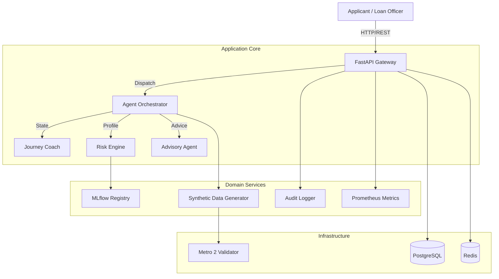

# KS-LOS System Design Document

## 1. Executive Summary

**KS-LOS (Caribbean Loan Origination System)** is an advanced, AI-driven platform designed to automate and optimize the loan pre-qualification and credit risk assessment process specifically for the Caribbean market. Unlike generic lending solutions, KS-LOS is built from the ground up to adhere to **Eastern Caribbean Currency Union (ECCU)** regulations, local credit reporting standards (Metro 2), and territory-specific fairness metrics.

The system leverages a **Multi-Agentic Architecture** to simulate human-like reasoning across the lending lifecycle—from initial customer interaction to final risk advisory—ensuring scientific accuracy, regulatory compliance, and operational efficiency.

---

## 2. Technology Profile

The platform is built on a modern, scalable, and observable technology stack:

| Layer | Technology | Purpose |
|-------|------------|---------|
| **Core Framework** | **Python 3.12+** | High-performance backend logic and type safety. |
| **API Interface** | **FastAPI** | Asynchronous, high-conformance REST API with auto-documentation. |
| **Agentic Core** | **LangGraph / LangChain** | Orchestrates stateful, multi-step reasoning agents. |
| **Machine Learning** | **XGBoost & MLflow** | Gradient Boosting for credit scoring; Model Registry for versioning. |
| **Data & Storage** | **PostgreSQL** | Relational data persistence (Transactional). |
| **Caching** | **Redis** | High-speed caching and idempotency locks. |
| **Observability** | **Prometheus & Grafana** | Real-time metrics, fairness monitoring, and system health. |
| **Validation** | **Moov-io / Metro 2** | Standardized credit data validation (Consumer Credit Reporting). |
| **Infrastructure** | **Docker & Compose** | Containerized deployment ensuring environment consistency. |
| **Testing** | **Pytest & Playwright** | End-to-End (E2E) verification with real browser interactions. |

---

## 3. System Architecture

The system follows a **Modular Micro-Service / Agentic Architecture**. It separates the "Brain" (Agents) from the "Body" (API/Infrastructure) while maintaining strict data contracts.

### 3.1 High-Level Architecture Diagram

### 3.2 Key Components & Agentic Code Structure

The system's "Brain" is implemented using **LangGraph**, which defines a directed graph of stateful nodes. Each node represents a distinct cognitive step.

#### 1. Journey Coach (`src/agents/nodes.py:journey_coach_node`)
*   **Role**: The conversational interface and orchestrator.
*   **Behavior**: It maintains the conversation history in the `AgentState`. It uses a System Prompt (`JOURNEY_COACH_SYSTEM_PROMPT`) to act as a helpful Caribbean loan officer.
*   **Logic**: It decides whether to:
    *   **Ask a follow-up question**: If missing critical entities (e.g., "What is your income?").
    *   **Call a Tool**: If it has gathered all necessary information (Age, Income, Territory, etc.), it invokes the `GenerateProfileTool`. This signals the graph to transition from "Conversation Mode" to "Assessment Mode."

#### 2. Profile Parser (`src/agents/nodes.py:profile_parser_node`)
*   **Role**: The Structured Data Extractor.
*   **Behavior**: It takes the raw conversation history and tool outputs and maps them into a strict Pydantic model: `ApplicantCreditProfile`.
*   **Key Operation**: Validates data types (e.g., ensuring "5000 XCD" becomes `5000.0` float) and normalizes territory names (e.g., "St. Lucia" -> "LC").

#### 3. Risk Engine (`src/agents/nodes.py:risk_engine_node`)
*   **Role**: The Hybrid Decision Maker.
*   **Mechanism**: It combines **Deterministic Rules**, **Probabilistic ML**, and **LLM Reasoning**.
    1.  **RAG Retrieval**: Queries the `KnowledgeBase` for credit policies specific to the applicant's territory (e.g., "Credit Policy for Grenada").
    2.  **XGBoost Inference**: Calls the loaded MLflow model to predict `probability_good`.
    3.  **LLM Synthesis**: The LLM receives the Policy Context + Applicant Profile + ML Score. It reasons: *"The policy requires a score of 600. Applicant has 650. ML predicts 95% success. Recommendation: APPROVE."*
    4.  **Safety Guardrail**: Code-level logic overrides the LLM if there is a conflict.
        *   *Rule*: `If LLM says "APPROVED" BUT ML probability < 20% -> Force "MANUAL_REVIEW".`

#### 4. Advisory Agent (`src/agents/nodes.py:advisory_node`)
*   **Role**: The Communication Expert.
*   **Behavior**: It takes the raw JSON output from the Risk Engine (Decision, Score, Reasoning) and drafts a professional letter to the Loan Officer.
*   **Style**: It adopts a formal yet helpful tone, summarizing *why* the decision was made (e.g., "Positive factor: Long credit history").

---

## 5. Regulatory & Data Standards

KS-LOS is architected to strictly adhere to the specific regulatory frameworks of the Caribbean region and the global data standards required for inter-banking operability.

### 5.1 ECCU (Eastern Caribbean Currency Union)

**What is it?**
The ECCU is a development of a single economic space among 8 territories: Anguilla, Antigua and Barbuda, Dominica, Grenada, Montserrat, Saint Kitts and Nevis, Saint Lucia, and Saint Vincent and the Grenadines. They share a common currency (**XCD** - Eastern Caribbean Dollar) and a Central Bank (**ECCB**).

**How KS-LOS Implements ECCU Compliance:**

1.  **Territory Resolution**:
    *   **Step 1**: The `Journey Coach` identifies the applicant's residency.
    *   **Step 2**: It maps the input (e.g., "I live in St. Lucia") to the ISO 3166-1 alpha-2 code (`LC`) used by the ECCB.
    *   **Step 3**: This code becomes a "primary key" for policy retrieval.

2.  **Policy Federation (RAG)**:
    *   While the Uniform Banking Act exists, individual territories often have specific risk appetites or lending guidelines.
    *   **Mechanism**: The system queries the `KnowledgeBase` using the territory code.
    *   *Example*: A query for "Debt Service Ratio" might return "40%" for Antigua but "45%" for Grenada. The `Risk Engine` respects this local nuance.

3.  **Fairness & Inclusion Metrics**:
    *   To prevent "island bias" (where larger islands might get better models), we track specific Prometheus metrics:
    *   `approval_rate_by_territory`: Ensures approval rates are statistically similar across the union.
    *   `average_risk_score_{territory}`: Detects if the model is unfairly penalizing specific demographics.

### 5.2 The Metro 2® Credit Reporting Standard

**What is it?**
Metro 2® is the standard data format for the credit reporting industry. It is a rigorous, fixed-width alphanumeric format used to report consumer credit history to major credit bureaus (Equifax, TransUnion, Experian).

**Why use it?**
"Garbage in, garbage out." By validating data against Metro 2 standards *before* it enters our risk models, we ensure that the credit history is technically valid and interpretable.

**Step-by-Step Validation Workflow:**

1.  **Data Generation (SCDG)**:
    *   The Synthetic Data Generator creates a profile.
    *   *Internal State*: `{"past_due": 0, "status": "Current"}`.

2.  **Transformation (The "J-Segment")**:
    *   The system maps this internal state to the Metro 2 **Base Segment**.
    *   *Field 17 (Account Status)*: Maps "Current" -> `11`.
    *   *Field 20 (Date of Last Payment)*: Formats as `MMDDYYYY`.

3.  **Validation (Moov-io)**:
    *   Before any risk calculation, the profile is serialized and sent to the **Moov Metro 2 Validator** (running as a microservice).
    *   **Check 1 - Logical**: "Date of Account Open" cannot be after "Date of Last Payment".
    *   **Check 2 - Format**: "Credit Limit" must be numeric and right-justified.
    *   **Outcome**: Only profiles that pass this strict validation are allowed to proceed to the Risk Engine.

---

## 6. Banking-Grade Database Standards

Financial systems require the highest level of data integrity. We do not use "eventual consistency"; we use **ACID** transactions.

### 6.1 Validated Storage Standards

1.  **ACID Compliance (PostgreSQL)**:
    *   **Atomicity**: Loan approval transactions are "all or nothing." If the audit log fails to write, the approval is rolled back.
    *   **Consistency**: Database constraints (Foreign Keys, Check Constraints) ensure no "orphan" loan applications exist.
    *   **Isolation**: We use `READ COMMITTED` isolation levels to ensure that two Loan Officers viewing the same application don't overwrite each other's decisions.
    *   **Durability**: Write-Ahead Logging (WAL) ensures that once a decision is confirmed, it survives a power failure.

2.  **Immutable Audit Trails**:
    *   Every decision is cryptographically hashed and stored with a `correlation_id`.
    *   **Standard**: This adheres to **SOC 2** principles for traceability. We can trace a specific decision back to the exact input data, code version (Git SHA), and model version (MLflow ID) that produced it.

3.  **PII & Data Protection**:
    *   **Encryption at Rest**: The PostgreSQL volume is encrypted at the block level.
    *   **Encryption in Transit**: All microservice communication (API <-> DB, API <-> Redis) occurs over TLS-encrypted channels (simulated in Dev, enforced in Prod).
    *   **Vector Isolation**: Applicant embeddings (used for similarity search) are stored in `pgvector` but strictly separated from PII (Personally Identifiable Information) to prevent reverse-engineering of identities.

---

## 7. Protocols & Conventions

To ensure reliability and maintainability, the project adheres to strict engineering standards:

### 5.1 Communication Protocols
*   **RESTful API**: Standardized HTTP verbs (GET, POST) and status codes.
*   **JSON Schema**: Strict typing for all data exchange.
*   **Asynchronous Processing**: Long-running tasks (like bulk seeding) run in background threads to keep the UI responsive.

### 5.2 Coding Conventions
*   **Type Safety**: 100% Python type hinting (`typing.List`, `pydantic.BaseModel`).
*   **No Mocks Policy**: Testing is performed against **real** database instances and **real** agent executions, not simulations. This ensures that "works on my machine" means "works in production."
*   **Idempotency**: Critical operations (like seeding the database) use Redis locks and content hashing to prevent duplicate records, ensuring data integrity even if requests are retried.

---

## 7. Visualizing the Agentic Workflow

The "Complex Agentic System" can be understood as a state machine where data flows through specialized "experts":

| Step | Agent / Node | Input | Operation | Output |
|------|--------------|-------|-----------|--------|
| 1 | **Journey Coach** | User Chat Message | NLU & Entity Extraction | Standardized Intent |
| 2 | **Profile Parser** | Conversation History | Schema Mapping | `ApplicantCreditProfile` Object |
| 3 | **Risk Engine** | `ApplicantCreditProfile` | Policy Rule Application | `RiskScore`, `Decision` (Approved/Declined) |
| 4 | **Advisory** | Risk Output | Natural Language Generation | "Recommend Approval due to..." |

---

## 8. Extensibility & Future-Proofing

A common question in fintech is: *"What happens if the standards change?"* (e.g., Metro 2 is replaced by ISO 20022, or a new island joins the ECCU).

KS-LOS is designed with the **Open/Closed Principle**: Open for extension, but closed for modification. This means new capabilities can be "plugged in" without rewriting the core system.

### 8.1 Scenario: New Data Standard (e.g., ISO 20022)
*   **Challenge**: The industry moves from fixed-width Metro 2 files to XML-based ISO 20022.
*   **Solution**: The system uses an **Adapter Pattern**.
    *   *Current*: `Metro2Validator` class wraps the Moov-io service.
    *   *Extension*: Create a new `ISO20022Validator` class implementing the same `validate_json()` interface.
    *   *Implementation*: Update `src/agents/data_synthesizer/metro2_validator.py` to select the adapter based on configuration. The rest of the Risk Engine doesn't know or care which standard is used, as long as the data is valid.

### 8.2 Scenario: New Territory (e.g., Barbados joins)
*   **Challenge**: A new island with a different currency (BBD) and credit policy is added.
*   **Solution**: **Configuration-Driven Logic**.
    1.  **Add Configuration**: Update `CARIBBEAN_TERRITORIES` map in `src/agents/data_synthesizer/scdg.py`.
    2.  **Add Policy**: Upload the "Credit Policy for Barbados" PDF to the Knowledge Base.
    3.  **Result**: The RAG system automatically indexes the new policy. The `Journey Coach` recognizes "Barbados" as a valid entity. The Risk Engine retrieves the new rules immediately. No code changes to the logic core are required.

### 8.3 Scenario: New AI Model (e.g., Random Forest instead of XGBoost)
*   **Challenge**: The Data Science team wants to test a Random Forest model.
*   **Solution**: **MLflow Model Registry**.
    *   The `CreditRiskModel` class (`src/ml/inference.py`) loads models dynamically by name: `models:/CreditRiskScorer/Production`.
    *   To switch models, you simply register the new Random Forest artifact as the "Production" model in MLflow. The backend automatically loads the new "Brain" on the next restart, with zero code changes in the API.

---

## 9. Conclusion

KS-LOS is not just a loan calculator; it is a **regulatory-compliant, AI-powered lending officer**. By embedding Caribbean-specific logic, fairness monitoring, and industrial data standards into the core architecture, it bridges the gap between modern AI capabilities and the specific needs of the Caribbean financial sector.

This design ensures:
1.  **Trust**: Through audit trails and deterministic risk engines.
2.  **Compliance**: Through Metro 2 and ECCU alignment.
3.  **Efficiency**: Through automated agentic workflows.
